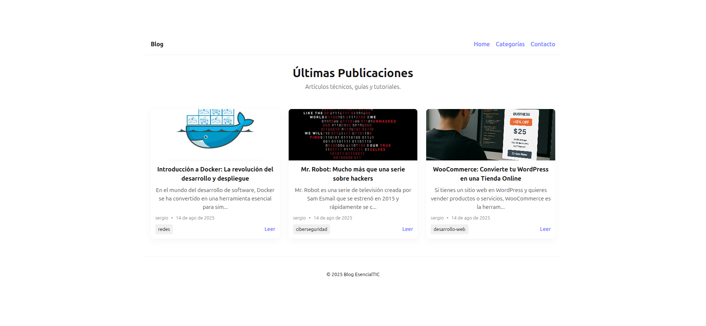
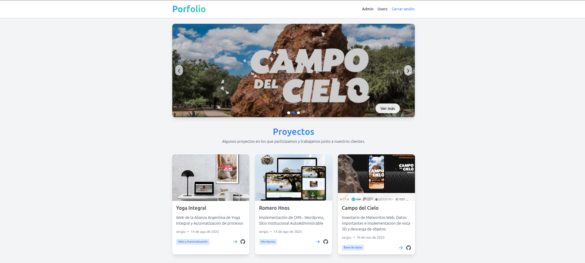
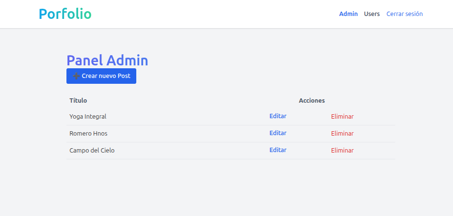
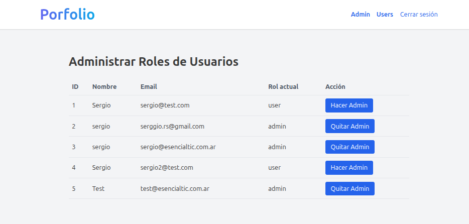
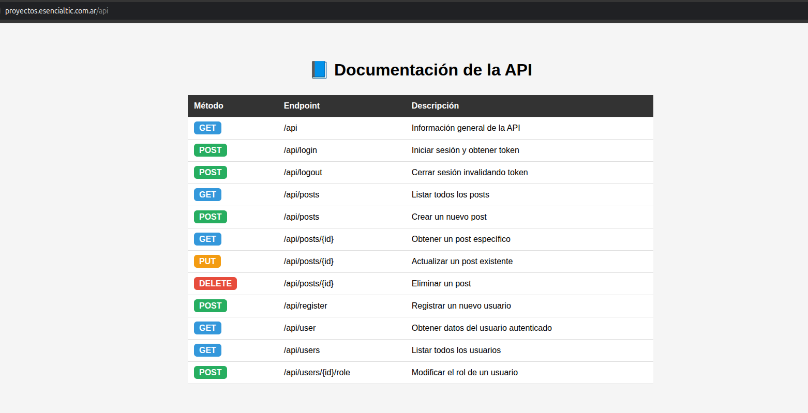

# React + Vite
Instalar dependencias
- npm i
Testing
- npm run dev
Optimizar tu código para producción
- npm run build

# blog-esencialtic porfolio

## 📰 Latest Posts Landing Page

### Vista previa del proyecto:

 v.1.0 (1ra Entraga Informatorio curso de React)

## 20-nov-2025 - Mejoras para segunda entrega del trabajo.

# Nueva vista v.2.0 del Panel para Gestión de proyectos para mostrarlos en la web principal de esencialtic.com.ar
Aparte de dejar funcionando un porfolio bonito

 (2da Entraga Informatorio curso de React)

### Gestor de Proyectos
 

### Gestor de Usuarios

# Fronted: React + Vite + tailwind
## Backend: Api Laravel + sanctum

### Api Backend - api proyectos

