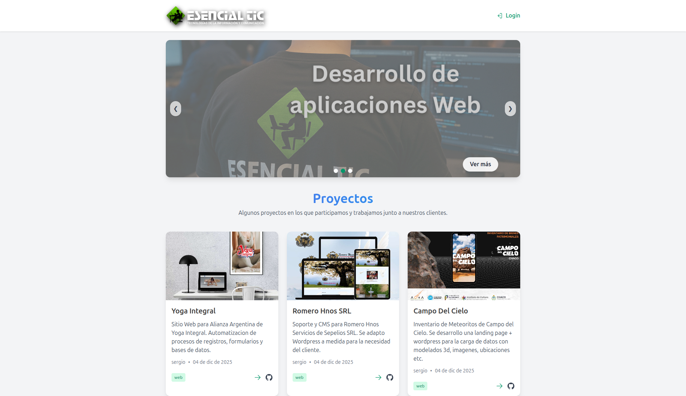
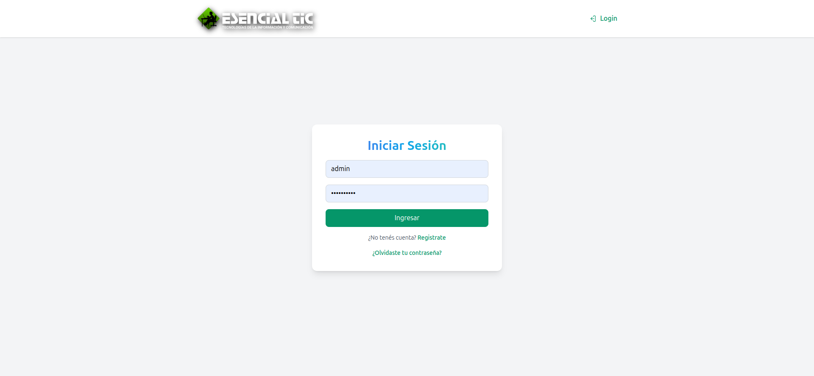
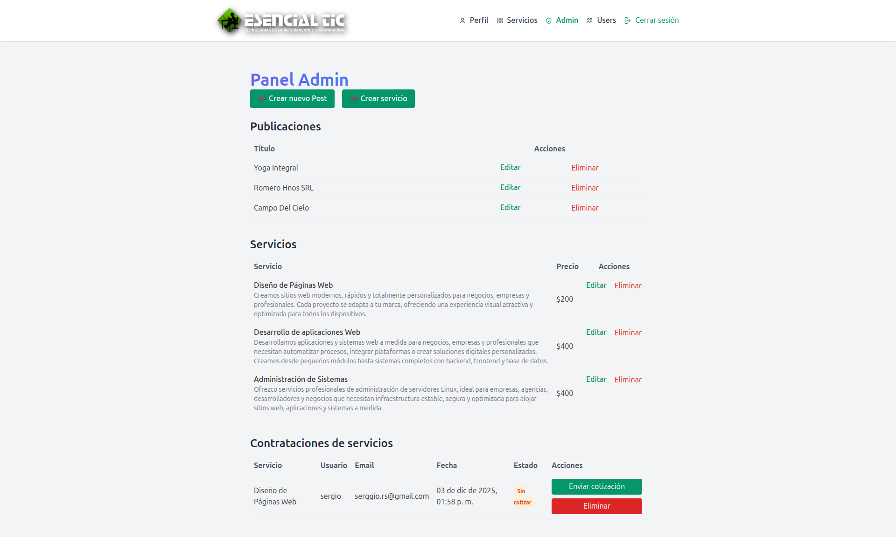
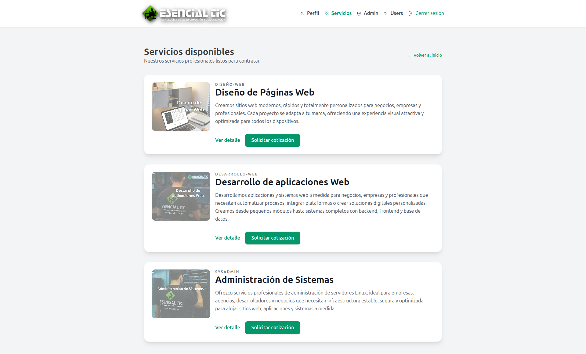
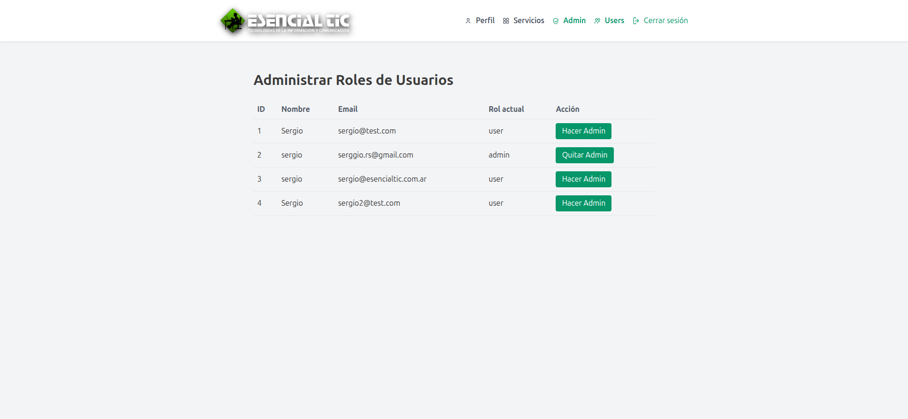
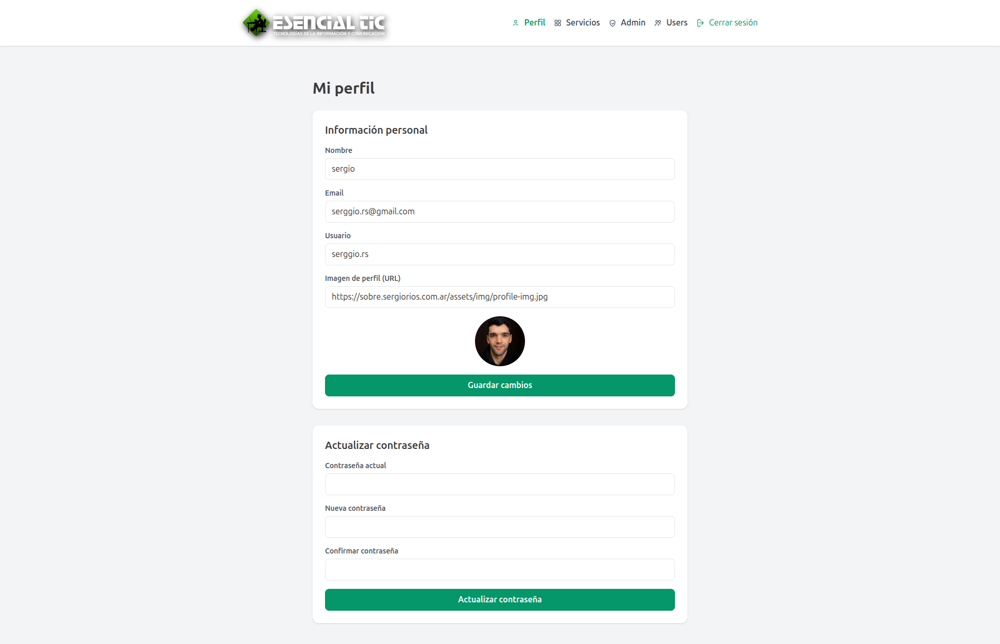
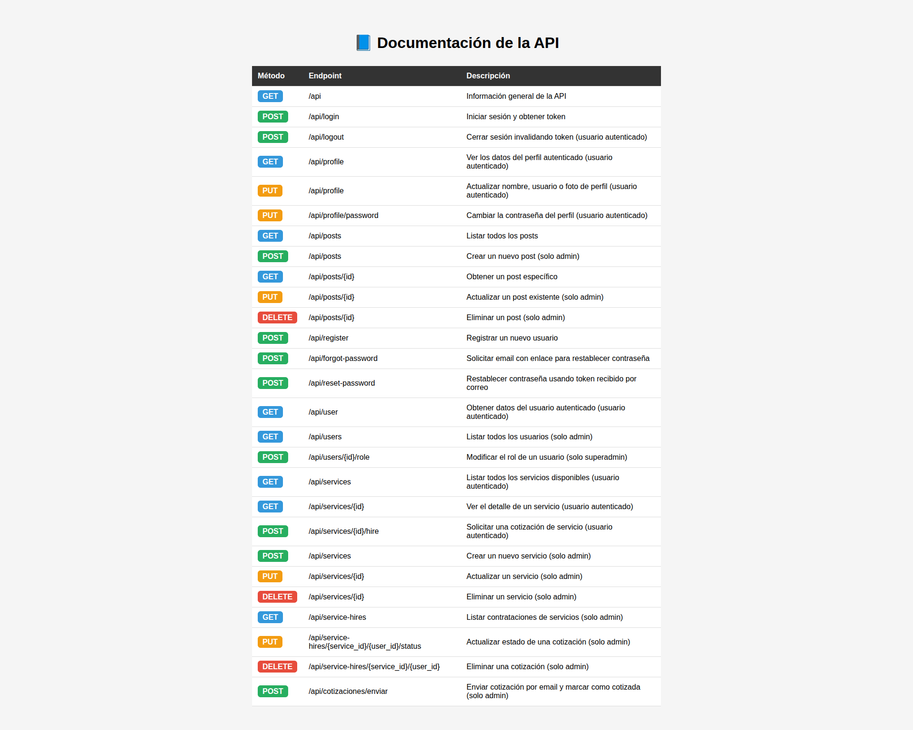

# React + Vite
### Instalar dependencias
- npm i
### Testing
- npm run dev
### Optimizar tu código para producción
- npm run build

# blog-esencialtic porfolio

## 📰 Latest Posts Landing Page

### Vista previa del proyecto:

 v.1.0 (1ra Entraga Informatorio curso de React)

## 20-nov-2025 - Mejoras para segunda entrega del trabajo.

# Nueva vista v.2.0 del Panel para Gestión de proyectos para mostrarlos en la web principal de esencialtic.com.ar
Aparte de dejar funcionando un porfolio bonito

 (2da Entraga Informatorio curso de React)

### Gestor de Proyectos
 

### Gestor de Usuarios

# Fronted: React + Vite + tailwind
## Backend: Api Laravel + sanctum

### Api Backend - api proyectos

### DOCs: https://proyectos.esencialtic.com.ar/api

## 07-dic-2025 - Mejoras para tercera entrega del trabajo.

# Nueva vista v.3.0 del Panel para Gestión de proyectos para mostrarlos en la web principal de esencialtic.com.ar
Aparte de dejar funcionando un porfolio bonito

 (3ra Entraga Informatorio curso de React)

## login
 

## Gestor de Proyectos, servicios y cotizaciones recibidas con funcion de envio de cotizacion por email
 

### Servicios
 

## Gestor de Usuarios

## Perfil

### Api Backend - api proyectos

### DOCs: https://proyectos.esencialtic.com.ar/api para revisar los permisos de los entpoint
##Cuenta con cuatro (4) perfiles (roles).
1-superusers (id=2)
Solo para gestion de usuarios
2-admin
Puede administrar servicios, publicaciones de proyectos, y ver pedidos de cotizacion y envios de cotizacion a los clientes.
3-usuarios registrados (clientes)
Pueden ver los proyectos, ver los servicios y pedir cotizacion
4-visitantes
Solo pueden ver los proyectos, deben registrarse si quieren ver los detalles de los servicios y pedir cotizacion.

superadmin, admin, y usuarios registrados pueden gestionar su perfil.
