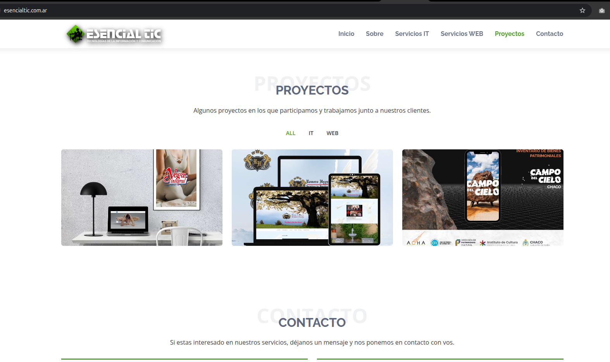

# Blog Esencialtic · Portfolio + Panel de Gestión

Aplicación React + Vite que reúne un portfolio público, un panel privado para gestionar proyectos/servicios y una integración directa con la API de esencialtic.com.ar para mantener todo sincronizado.

---

## 🚀 Puesta en marcha

| Acción | Comando |
| --- | --- |
| Instalar dependencias | `npm install` |
| Servidor de desarrollo | `npm run dev` |
| Build de producción | `npm run build` |

---

## 🧱 Stack

- **Frontend:** React + Vite + Tailwind CSS
- **Backend / API:** Laravel + Sanctum (`https://proyectos.esencialtic.com.ar/api`)
- **Roles disponibles:**
  1. `superusers` (id = 2) · gestión de usuarios
  2. `admin` · servicios, proyectos, cotizaciones
  3. `usuarios registrados` · ven proyectos/servicios y piden cotizaciones
  4. `visitantes` · solo visualización pública

Superadmin, admin y usuarios registrados pueden administrar su perfil dentro de la app.

---

## 📚 Historial de entregas

### 1️⃣ 1ra Entrega · v1.0 — Landing de posts recientes
- Versión inicial enfocada en mostrar publicaciones del blog estilo portfolio.
- **Screenshot:**  
  

### 2️⃣ 2da Entrega · v2.0 (20-nov-2025) — Panel de proyectos
- Se agregó un panel renovado para gestionar proyectos y exponerlos en la web principal.
- Incluye primeras vistas del gestor de proyectos y usuarios.
- **Panel principal:**  
  
- **Gestor de Proyectos:**  
  
- **Gestor de Usuarios:**  
  
- **API de proyectos (Laravel + Sanctum):**  
  

### 3️⃣ 3ra Entrega · v3.0 (07-dic-2025) — Panel completo + perfiles
- Panel mejorado que integra servicios, proyectos y envío de cotizaciones por email.
- Portfolio público actualizado y se documentaron todos los flujos principales.
- **Portfolio público:**  
  
- **Login:**  
  
- **Dashboard general (proyectos/servicios/cotizaciones):**  
  
- **Servicios:**  
  
- **Gestor de Usuarios:**  
  
- **Perfil del usuario:**  
  
- **API Backend / permisos:**  
  

---

## 🎯 Objetivo

Centralizar la gestión de proyectos y servicios de esencialtic.com.ar desde mi portfolio, permitiendo publicar rápidamente en la web principal y vincular cada servicio con un flujo de cotización en un clic.

**Vista general del sitio de proyectos:**  

